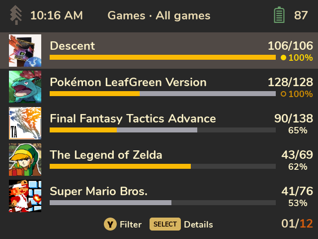
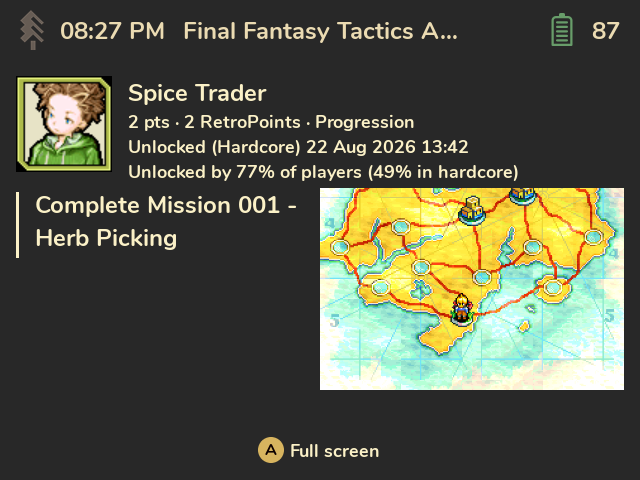

# Cheevos

Your [RetroAchievements](https://retroachievements.org) on your
[SpruceOS](https://github.com/spruceUI/spruceOS) handheld: profile, game progress, every
achievement with its badge, awards and the screenshots RetroArch took when you unlocked them.
Works offline, follows your Spruce theme.

  
  

## Features
- **Progress bars like RetroAchievements' own:** hardcore in gold, casual in grey, a dot for
  mastered and beaten games.
- **Achievements as a list or a badge grid**, with points, rarity, type tags and unlock dates.
  Filter and sort them.
- **Unlock screenshots** shown on each achievement, and full screen.
- **Profile, recent unlocks and an awards wall.**
- **Offline-ready:** everything is cached on the SD card, and syncs only fetch what changed.
  Unlocks still waiting in RAOfflineProxy show as "Pending sync".
- **Optional spoiler protection** for locked descriptions: all of them, or just the story ones.

## Install
1. You need **SpruceOS 4.5.0+**, signed in to RetroAchievements (Spruce Settings →
   RetroAchievements, or RetroArch). Tested on the Miyoo Mini family; other Spruce devices
   should work too, see below.
2. Download the latest [release](../../releases) and copy the `Cheevos` folder into `App/` on
   your SD card.
3. Open **Apps → Cheevos** and enter your **Web API key** when asked. Find it at
   retroachievements.org → Settings → Keys.

The [user guide](docs/Home.md) explains every screen, setting and limitation.

## Development
Python 3.10 with no third-party packages at runtime; the screens are drawn with PyUI, the UI
toolkit SpruceOS ships. A desktop runner shows the real app on a Mac or PC without a device.
- [CONTRIBUTING.md](CONTRIBUTING.md): reporting bugs and devices, making changes, pull requests.
- [TESTING.md](TESTING.md): setup, tests, the desktop runner, simulations, the device workflow.
- [AGENTS.md](AGENTS.md) and [.agents/](.agents/): how it works inside, area by area. Written for
  coding agents, and just as useful to people.

**Help testing on other Spruce devices is welcome.** Cheevos installs on every Spruce device, but
so far it's only been tried on the Miyoo Mini family. On other devices it says so on first
start; if you try it, please open an issue with how it went and the log
(`Saves/spruce/cheevos-<device>.log`), see [CONTRIBUTING.md](CONTRIBUTING.md).

## Credits and license
MIT, see [LICENSE](LICENSE). Data, badges and game icons come from
[RetroAchievements.org](https://retroachievements.org); Cheevos isn't affiliated with it. Screens
are drawn with PyUI (Copyright (c) 2025 Christopher Jacobs), which SpruceOS installs; it isn't
bundled. List icons: [pixelarticons](https://github.com/halfmage/pixelarticons) (MIT). Details in
[THIRD_PARTY_NOTICES.md](THIRD_PARTY_NOTICES.md).
