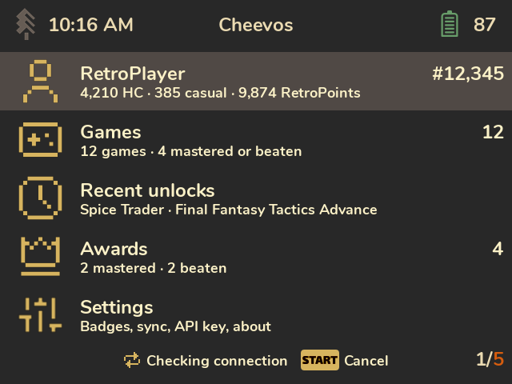

# Controls

Cheevos follows the button conventions of Spruce's own menus.

| Button | What it does |
|---|---|
| D-pad | Move. On the profile: scroll. |
| A | Open or confirm. On an achievement with a screenshot: show it full screen. |
| B | Back. On the home screen: leave Cheevos. |
| Start | Sync now, or cancel the running sync. Works on every screen. After "API key rejected": enter a new key. |
| Y | Filter and sort (games, a game's achievements, awards). |
| X | Reveal a hidden description (achievement). See more (profile). |
| Select | Switch view: progress bars ↔ details (games), list ↔ grid (a game's achievements). |
| L1 / R1 | Page up / down. |

You don't need to remember this table: the bottom bar shows the buttons that do something on the
current screen, for example **[Y] Filter [SELECT] Details** on the games list.

The sync status sits in the bottom bar too. Home and Settings always show it ("Synced 5 min
ago"). Other screens show it only while a sync runs and for a few seconds after it ends.

## On-screen keyboard
The keyboard appears when you type your Web API key (see [Setup](Setup.md)). It's Spruce's own
keyboard:

| Button | What it does |
|---|---|
| D-pad | Move between keys |
| A | Type the highlighted key (↵ finishes, ← deletes, ⇪ and ↑ switch case) |
| B | Delete the last character. With nothing typed: cancel. |
| Start | Done |
| L1 | Shift: the next letter is a capital |
| R1 | Caps lock |
