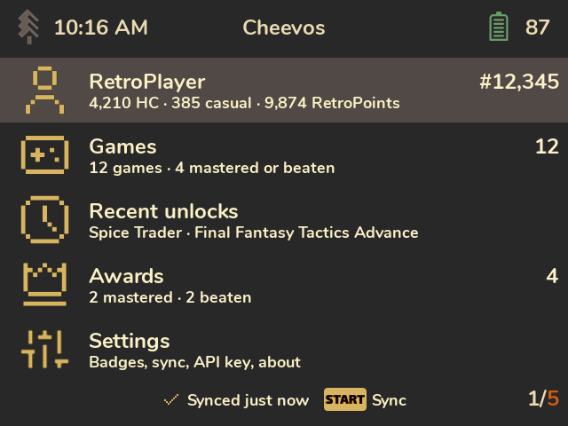

# Cheevos

**Your RetroAchievements, on your handheld.** Cheevos is an app for
[SpruceOS](https://github.com/spruceUI/spruceOS) that shows your
[RetroAchievements](https://retroachievements.org) profile, game progress, achievements, awards
and unlock screenshots, right on the device, in the look of your Spruce theme.

## What it does
- **Your games with progress bars**, drawn the way RetroAchievements draws them: hardcore
  unlocks in gold, casual unlocks in grey, and a dot for mastered and beaten games.
- **Every achievement of a game**, as a list or a badge grid: badges, points, rarity, type tags
  (progression, win condition, missable) and the date you unlocked it.
- **Unlock screenshots:** if RetroArch saves a screenshot when you unlock an achievement,
  Cheevos shows it on the achievement and full screen.
- **Recent unlocks** across all games, and an **awards wall** of your mastered and beaten games.
- **Your profile:** points, rank, last played game, player stats and games per console.
- **Works offline.** Everything is cached on the SD card. When Wi-Fi is on, Cheevos syncs only
  what changed.
- **Offline unlocks.** If you use RAOfflineProxy, unlocks waiting to be sent to
  RetroAchievements show up as "Pending sync".
- **Spoiler-free if you like:** hide the descriptions of locked achievements, all of them or just
  the story ones.

## Pages
- [Installation](Installation): requirements, installing, updating, removing.
- [Setup](Setup): your username and Web API key.
- [Screens](Screens): a tour of every screen.
- [Controls](Controls): buttons on every screen.
- [Sync and offline play](Sync-and-Offline-Play): what syncing does, offline use, RAOfflineProxy.
- [Settings](Settings): every option explained.
- [Themes and devices](Themes-and-Devices): themes, resolutions, supported devices.
- [Limitations](Limitations): what Cheevos doesn't do, and why.
- [Troubleshooting](Troubleshooting): common problems, logs, data and privacy.

Cheevos isn't affiliated with RetroAchievements or SpruceOS. All data, badges and game icons
come from RetroAchievements.org through its public Web API.
