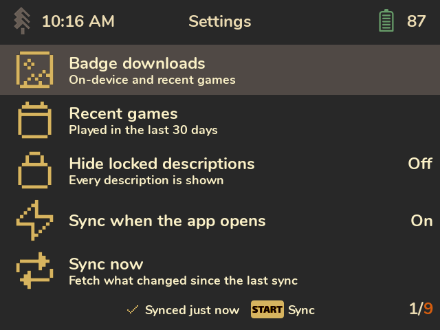

# Settings

| Setting | What it does |
|---|---|
| **Badge downloads** | Which badges a sync downloads ahead of time, so they're there offline. **On-device and recent games** (default): games Spruce recognised on the SD card, plus games played recently. **All games**: everything; takes more space and a longer first sync. **Only while browsing**: nothing ahead of time; badges load when you open a game online. |
| **Recent games** | What "recently" means for badge downloads: 7, 30 (default) or 90 days. |
| **Hide locked descriptions** | Spoiler protection. **Off** (default): every description is shown. **Story only**: hides locked achievements tagged *Progression* or *Win condition*, the story beats and the ending. **All**: hides every locked one. Press X on an achievement to reveal it anyway. |
| **Sync when the app opens** | On (default) or off. Off means syncs only run when you press Start. |
| **RAOfflineProxy** | Shown only when the proxy is installed: whether it's on, online, how many unlocks wait to sync, how many games it has cached. Press A for an explanation. See [Sync and offline play](Sync-and-Offline-Play). |
| **Sync now** | Same as pressing Start. |
| **Full re-sync** | Fetches every game's achievements again. |
| **Web API key** | Shows the end of the current key; press A to enter a new one. |
| **Clear image cache** | Deletes downloaded badges and icons (shows how much space they use). They download again when needed. |
| **About** | Version, license and credits. |

**A note on "Story only":** RetroAchievements has no spoiler flag. "Story only" relies on the type
tags set developers add (Progression, Win condition, Missable). Tagging started in 2023, so many
older sets have no tags, and "Story only" hides nothing there. Use **All** for those games.

Settings are saved in `Saves/cheevos/settings.json`.
