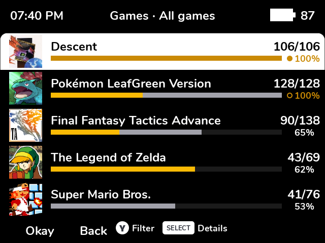
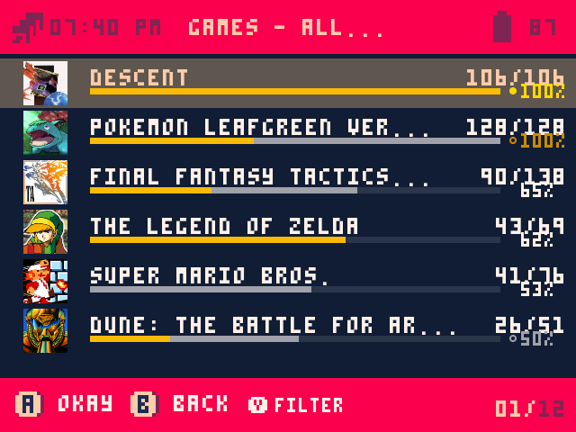
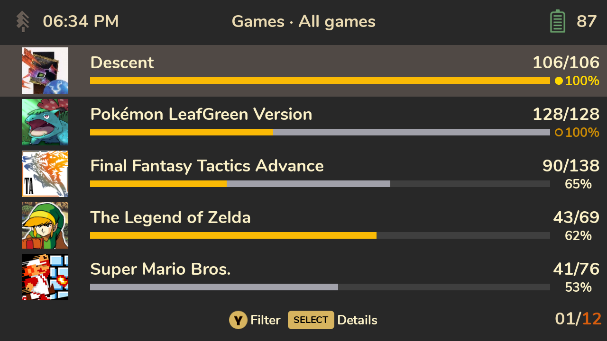

# Themes and devices

## Themes
Cheevos is drawn with Spruce's own UI toolkit, so it uses your theme's fonts, colours,
backgrounds, highlight and button badges. Progress bars and award markers use
RetroAchievements' gold and silver where they're readable on your theme, and the theme's own text
colour where they aren't (on a yellow theme, for example).

| SPRUCE | MINIMAL | Pico-8 |
|---|---|---|
|  |  |  |

Themes with their own button hints in the bottom bar ("A Okay B Back") keep them; Cheevos adds
its hints after them. Theme fonts don't have emoji, so emoji in rich presence texts are left out.
Some pixel fonts lack accented letters; Cheevos then shows the plain letter ("Pokemon").

## Resolutions
Every resolution Spruce's default theme supports is laid out properly: 640×480, 720×480,
752×560, 720×720, 960×720, 1024×768, 1280×720 and 480×800. Icons are drawn at whole-pixel sizes
so the pixel art stays sharp.

## Devices
Cheevos is **tested on the Miyoo Mini+**, and the rest of the **Miyoo Mini family** (Mini,
Mini v4, Mini Flip) shares its hardware and software setup.

It's installed and started the same way on Spruce's other devices (Miyoo A30 and Flip, TrimUI
Brick and Smart Pro, Anbernic RG devices, and more): its launcher uses the same settings Spruce
uses to start its own UI on each of them. They just haven't been tried yet, so please report
how it went.

If it doesn't start at all, you get a short message ("Cheevos couldn't start") and are back in
Spruce's menu: nothing is changed on your SD card. Either way, a report with the log
(`Saves/spruce/cheevos-<device>.log`) on the project's GitHub page helps get your device
confirmed.
